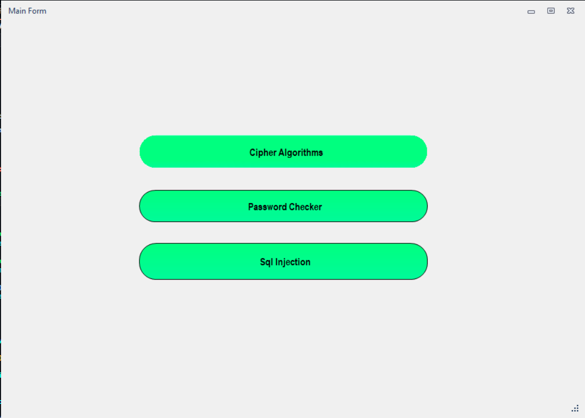
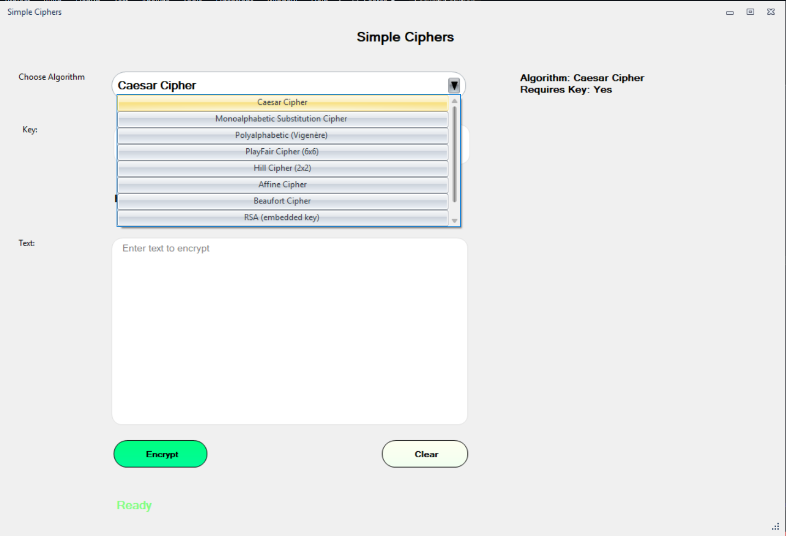

# Security Algorithms Suite

A comprehensive Windows Forms application built with .NET 8 and Krypton Toolkit that implements a collection of classical and modern cryptography algorithms. This project demonstrates clean, modular code architecture using service-based patterns.

## 1. Project Overview

The **Security Algorithms Suite** is a desktop tool designed for educational and practical purposes in the field of information security. It allows users to encrypt and decrypt text using various algorithms, ranging from historical ciphers to modern implementations like RSA.

**Key Highlights:**

- **Framework:** .NET 8.0 (Windows Forms)
- **UI library:** Krypton Toolkit for a modern look and feel.
- **Mathematical Support:** MathNet.Numerics for complex calculations (e.g., Matrix operations in Hill Cipher).
- **Architecture:** Usage of `ICipherService` interface to standardize algorithm implementation and allow easy extensibility.

## 2. Features

- **Encryption & Decryption:** Support for multiple algorithms with real-time feedback.
- **Modular Architecture:** Each algorithm is implemented as a standalone service implementing `ICipherService`.
- **Key Management:**
  - Manual key entry validation.
  - **Auto-generation** of keys for supported algorithms (e.g., Monoalphabetic, Hill, Affine).
- **Advanced Tools:**
  - **Password Strength Checker:** Analyze password complexity.
  - **SQL Injection Testing:** (Demonstration form included).
- **User Interface:** Modern, responsive UI with themed controls via Krypton Toolkit.

## 3. Supported Algorithms

| Algorithm          | Key Requirements        | Auto Key Gen | Notes                                                      |
| ------------------ | ----------------------- | :----------: | ---------------------------------------------------------- |
| **Affine**         | 2 integers (a, b)       |      ✅      | Requires `gcd(a, 52) == 1`.                                |
| **Auto-Key**       | String key              |      ❌      | Auto-key usage extending plaintext.                        |
| **Beaufort**       | String key              |      ❌      | Similar to Vigenère but uses `(K - P) % 26`.               |
| **Caesar**         | Integer shift           |      ❌      | Classic substitution cipher.                               |
| **Hill**           | 4 integers (2x2 Matrix) |      ✅      | Uses matrix multiplication and modular inverse.            |
| **Monoalphabetic** | Permuted Alphabet       |      ✅      | Replaces each letter with a unique mapped letter.          |
| **PlayFair**       | String phrase           |      ❌      | Uses a 6x6 grid                                            |
| **Polyalphabetic** | String key              |      ❌      | Vigenère cipher implementation.                            |
| **RSA**            | Public/Private Keys     |      ❌      | Uses large prime numbers (P, Q) and BigInteger arithmetic. |

## 4. Project Structure

The solution matches a clean separation of concerns:

- **SecuritySolution/** - Main Project Directory
  - **Algorithms/** - Core logic for all ciphers (e.g., `HillCipher.cs`, `RSACipher.cs`).
  - **Service/** - Service wrappers integrating algorithms with the UI logic.
  - **ServiceContract/** - Interfaces defining the contract (`ICipherService.cs`).
  - **Forms/** - User Interface components (not in a single folder, but includes `CipherAlgorithmsForm.cs`, `MainForm.cs`, etc.).
  - **Models/** - Data models used for passing encryption results.
  - **Helpers/** - Utility extensions and helpers.

## 5. Installation & Running

### Prerequisites

- [Visual Studio 2022](https://visualstudio.microsoft.com/) (or later) with .NET Desktop Development workload.
- .NET 8.0 SDK.

### Steps

1. **Clone the repository:**
   ```bash
   git clone https://github.com/Ibrahim-Hassan74/Securite.git
   ```
2. **Open the Solution:**
   - Navigate to the folder and open `SecuritySolution.sln` in Visual Studio.
3. **Restore Dependencies:**
   - Visual Studio should automatically restore NuGet packages (Krypton).
   - If not, run: `dotnet restore` in the Package Manager Console.
4. **Setting up the database**
   - download [rockyou.txt](https://drive.google.com/drive/folders/11_JyS9_hfoxz5AG1BFpK18agvTm4V5HX)
   - place rockyou.txt in ./Security/RUNDB/
   - right click on PreparePasswordsDB and select "set as startup project"
   - run PreparePasswordsDB.cs project to load the database
   - if the run throws an exception create a database called Security and run again
5. **Run the Application:**
   - Set `SecuritySolution` as the Startup Project.
   - Press **F5** or click **Start**.

## 6. Usage

1. **Select Algorithm:** Use the main dropdown menu to choose an encryption method (e.g., "PlayFair").
2. **Input Text:** Enter the message you want to encrypt in the "Plaintext" box.
3. **Manage Key:**
   - Enter a valid key manually, OR
   - Click **Generate Key** (if enabled) to create a random valid key.
4. **Encrypt/Decrypt:**
   - Click **Encrypt** to see the Ciphertext.
   - Click **Decrypt** to reverse the process using the current key.
5. **Navigation:** Use the side or top menu to switch between "Cipher Algorithms", "Password Checker", and other tools.

## 7. Screenshots


|          Main Interface           |          Algorithm Selection          |
| :-------------------------------: | :-----------------------------------: |
|  |  |

## 8. How Algorithms Work

- **Ceasar:** Mathematical substitution based on `(ax + b) % 26`.
- **Hill Cipher:** Uses linear algebra. Text is divided into vectors and multiplied by a Key Matrix modulo 26. Decryption requires the matrix inverse.
- **RSA:** Asymmetric encryption.
  - Keys are derived from two large primes $P$ and $Q$.
  - Encryption: $C = P^E \mod N$
  - Decryption: $P = C^D \mod N$

## 9. Contributing

We welcome contributions to add new algorithms!

1. Create a new class in `Algorithms/` implementing the specific logic (static helper).
2. Create a service in `Service/` that implements `ICipherService`.
3. Define the `Id`, `Name`, and implement `Encrypt`/`Decrypt`.
4. Register the new service in the main form or factory to appear in the UI.

## 10. License

This project is licensed under the MIT License - see the LICENSE file for details.

---

## 👥 Project Contributors

This project is part of the **Information Security (IT451)** course.
The following contributors participated in building and implementing the system:

- **Ibrahim Hassan** (@Ibrahim-Hassan74)
- **Mostafa Mohamed** (@Mustafa-Mo7amed)
- **Ahmed Salah** (@AhmedSalaaah0)
- **Ahmed Hosny** (@a7medhosny)
